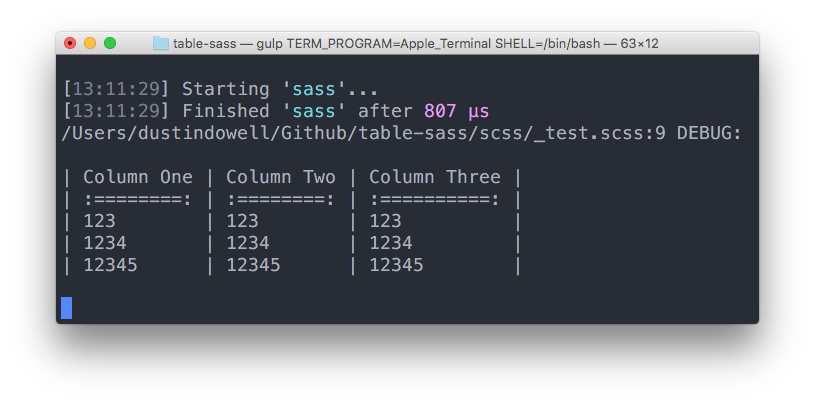

Table Sass
==========

Monospaced text tables for Sass.



---

## Setup
### Install
```
bower install table-sass --save
```

### Import
```scss
@import '../bower_components/table-sass/main';
```

---

## Usage
1. Make a list of lists where each sublist is a row in the table.
1. Send it to the `table()` function.

```scss
$table: (
  ('Column One', 'Column Two', 'Column Three'),
  (':========:', ':========:', ':==========:'),
  ('123', '123', '123'),
  ('1234', '1234', '1234'),
  ('12345', '12345', '12345')
);

@debug table($table);
```

---

## Variables
### `$table-padding`
+ The amount of spaces before and after each separator.
+ Set to `1` by default.

### `$table-separator`
+ The character that delimits each cell.
+ Set to `|` by default.

---

## Functions
### `table-width($list)`
+ Generates a list of the longest rows in each column.
+ Used internally.

### `table-str-repeat($string, $count)`
+ Generates a repeating string.
+ Used internally.

### `table($list)`
+ Outputs a table from a list of lists.

---
